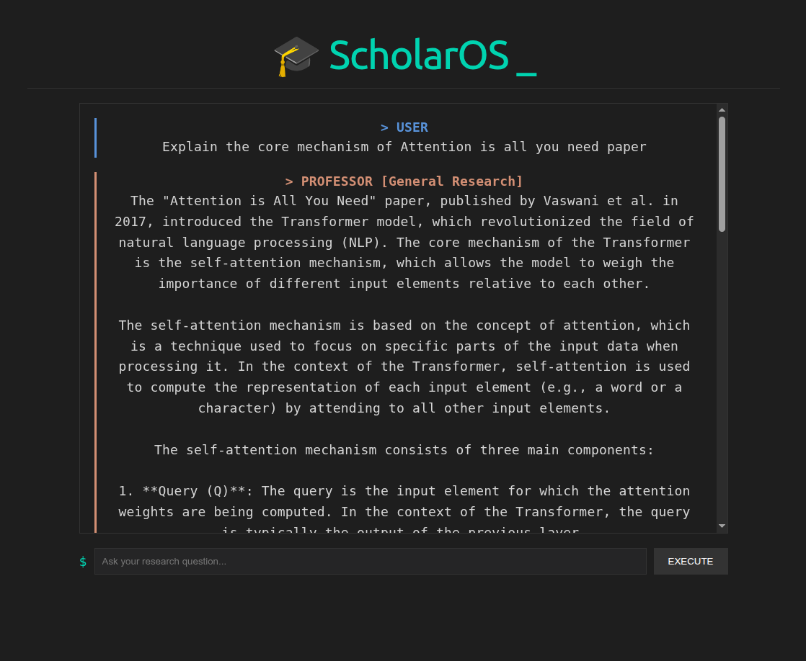

# 🎓 ScholarOS



**ScholarOS** is an autonomous AI Research Assistant that identifies, retrieves, and explains scientific papers. By combining **LangGraph** for agentic orchestration, **Groq (Llama 3.3-70b)** for high-speed reasoning, and **ChromaDB** for RAG-based grounding, it turns complex ArXiv papers into digestible technical insights.

-----

## System Architecture

ScholarOS operates as a stateful graph where specialized agents collaborate to fulfill a research request:

1.  **The Manager:** Analyzes the user's query and decides if a new paper needs to be researched or if the request can be handled using existing knowledge.
2.  **The Researcher:** Interfaces with the ArXiv API, downloads relevant PDFs, and processes them into a vector database (ChromaDB).
3.  **The Educator:** Uses the retrieved context to provide technically grounded explanations, ensuring the AI "Professor" stays factually accurate.

-----

## Project Structure

```text
ScholarOS/
├── apps/
│   ├── api/            # FastAPI Server
│   └── web/            # React (Vite) Frontend
├── packages/
│   ├── agents/         # Manager, Researcher, and Educator logic
│   ├── core/           
│   │   ├── graph/      # LangGraph state and builder definitions
│   │   ├── providers/  # Groq, Gemini, and Base LLM abstractions
│   │   └── database/   # ChromaDB / Vector Service
│   └── shared/         # Pydantic schemas and shared utilities
├── .env                # API Keys (GROQ_API_KEY, etc.)
└── pyproject.toml      # UV Managed dependencies
```

-----

## Getting Started

### 1\. Prerequisites

  * **Node.js** (v18+)
  * **Python 3.10+**
  * **uv** (Python package manager)

### 2\. Installation & Environment

```bash
# clone the repo 
git clone https://github.com/Kidus-Yoseph1/ScholarOS.git

```

```bash
# Sync all dependencies using uv
uv sync

# Create your .env file in the root
# use .env.examples as a sample
```

### 3\. Run the Backend (FastAPI)

From the project root:

```bash
uv run uvicorn apps.api.main:app --reload --port 8000
```

### 4\. Run the Frontend (React)

Open a **second** terminal:

```bash
cd apps/web/apps/web
npm install
npm run dev
```

Visit `http://localhost:5173` to start researching.

-----

## 🔧 Technologies Used

  * **Orchestration:** LangGraph
  * **LLMs:** Llama 3.3 (via Groq), gemini-2.5-flash
  * **Embeddings:** Hugging Face (`all-MiniLM-L6-v2`)
  * **Vector Store:** ChromaDB
  * **Backend:** FastAPI
  * **Frontend:** React + Vite

----

# TODOs:
* Switch to multiple providers
* Memory and History
* Note saving
* Quize and flash card generation